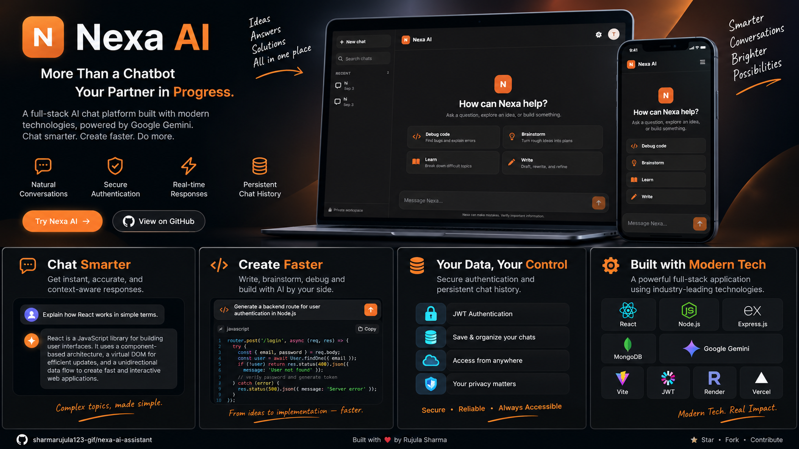

# Nexa AI 🤖
<p align="center">
  
</p>

A modern full-stack conversational AI platform powered
by Google Gemini.

Secure authentication • Persistent conversations • Real-time AI
streaming

------------------------------------------------------------------------

## 📌 Overview

**Nexa AI** is a full-stack conversational AI application designed for
natural, persistent, and responsive AI interactions.

Users can create an account, start conversations, search and manage chat
history, and receive AI responses in real time through Server-Sent
Events (SSE).

## ✨ Features

-   🔐 JWT-based authentication with secure password hashing
-   💬 Persistent conversation history
-   🤖 Google Gemini AI integration
-   ⚡ Real-time streamed AI responses using SSE
-   🔎 Search conversations
-   ✏️ Rename conversations
-   🗑️ Delete conversations
-   🌙 Dark / light mode
-   📱 Responsive chat interface
-   📝 Markdown and syntax-highlighted AI responses
-   🛡️ Protected user-specific conversations

## 🛠️ Tech Stack

### Frontend

-   React
-   Vite
-   React Markdown
-   Remark GFM
-   Rehype Highlight
-   CSS

### Backend

-   Node.js
-   Express.js
-   MongoDB
-   Mongoose
-   JWT
-   bcrypt
-   Google Gemini API
-   Server-Sent Events

## 🏗️ Architecture

``` text
┌─────────────────────┐
│     React + Vite    │
│      Frontend       │
└──────────┬──────────┘
           │ REST API / SSE
           ▼
┌─────────────────────┐
│   Node.js + Express │
│       Backend       │
└───────┬───────┬─────┘
        │       │
        ▼       ▼
   ┌────────┐ ┌─────────────┐
   │MongoDB │ │ Gemini API  │
   └────────┘ └─────────────┘
```

## 📁 Project Structure

``` text
nexa-ai-assistant/
├── client/                 # React frontend
│   ├── src/
│   ├── public/
│   └── package.json
│
├── server/                 # Node.js backend
│   ├── middleware/
│   ├── models/
│   ├── routes/
│   ├── utils/
│   └── server.js
│
├── render.yaml             # Deployment configuration
├── .gitignore
└── README.md
```

## 🚀 Getting Started

### Prerequisites

Make sure you have installed:

-   Node.js 18+
-   MongoDB or MongoDB Atlas
-   Google Gemini API key

### 1. Clone the repository

``` bash
git clone https://github.com/sharmarujula123-gif/nexa-ai-assistant.git
cd nexa-ai-assistant
```

### 2. Setup the backend

``` bash
cd server
npm install
```

Create a `.env` file:

``` env
PORT=8080
MONGODB_URI=your_mongodb_uri
JWT_SECRET=your_jwt_secret
GEMINI_API_KEY=your_gemini_api_key
CLIENT_URL=http://localhost:5173
```

Start the backend:

``` bash
npm run dev
```

### 3. Setup the frontend

Open another terminal:

``` bash
cd client
npm install
```

Create `.env`:

``` env
VITE_API_URL=http://localhost:8080/api
```

Start the frontend:

``` bash
npm run dev
```

The application will be available at:

``` text
http://localhost:5173
```

## 🔑 API Overview

  Method   Endpoint                  Purpose
  -------- ------------------------- ---------------------------------------
  POST     `/api/auth/register`      Create an account
  POST     `/api/auth/login`         Authenticate a user
  GET      `/api/auth/me`            Get current user
  GET      `/api/threads`            List conversations
  GET      `/api/thread/:threadId`   Get a conversation
  PATCH    `/api/thread/:threadId`   Rename a conversation
  DELETE   `/api/thread/:threadId`   Delete a conversation
  POST     `/api/chat`               Send a message and stream AI response
  GET      `/api/health`             Check API and database status

## 🔒 Security

Nexa AI keeps sensitive configuration outside the source code using
environment variables.

-   Passwords are hashed with bcrypt
-   Protected routes use JWT authentication
-   Conversations are scoped to authenticated users
-   API credentials are stored in environment variables
-   `.env` files are excluded from Git

**Never commit real API keys, database credentials, or JWT secrets.**

## 📚 Documentation

Detailed documentation is available inside each application:

-   [`client/README.md`](client/README.md) for frontend setup and
    details
-   [`server/README.md`](server/README.md) for backend setup and API
    details

## 🚧 Future Improvements

-   Refresh token authentication
-   Automated testing
-   API documentation with OpenAPI / Swagger
-   Docker support
-   Additional AI model providers
-   File and image support
-   Conversation export
-   Production monitoring

## 👩‍💻 Author

**Rujula Sharma**

GitHub: [@sharmarujula123-gif](https://github.com/sharmarujula123-gif)

------------------------------------------------------------------------

```{=html}
<p align="center">
```
Built with React, Node.js, MongoDB, and Google Gemini.
```{=html}
</p>
```
